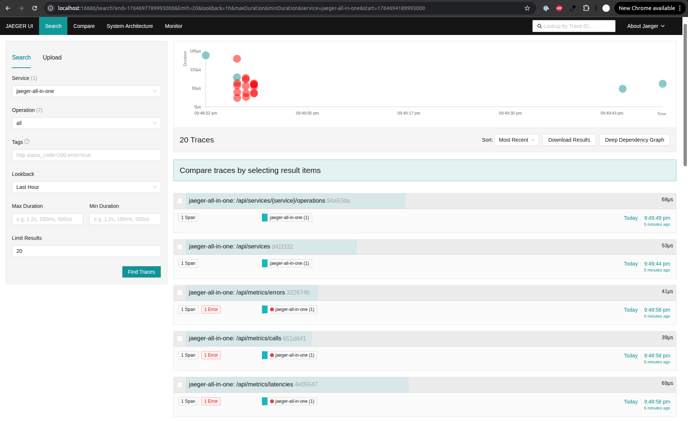

# vLLM Production Stack with Distributed Tracing & LoRA

This project demonstrates a production-grade deployment of **vLLM** on Kubernetes, featuring multi-model serving (Vision-Language & Text), LoRA adapters, distributed tracing, and load testing.

## 🚀 Features

- **Multi-Model Deployment**: Running Qwen3-VL-30B (Vision) and Qwen3-8B (Text) simultaneously.
- **LoRA Support**: Dynamic loading of LoRA adapters (Translation, Gaia) on the 8B model.
- **Distributed Tracing**: Full OpenTelemetry (OTEL) integration with Jaeger for visualizing request flows.
- **Load Testing**: Integrated `llmperf` setup for benchmarking and traffic generation.
- **High Performance**: Optimized for NVIDIA H100 GPUs.

## 📋 Prerequisites

- **Hardware**: NVIDIA GPUs (H100 recommended for this specific config).
- **Software**:
  - Docker
  - Minikube (with GPU support)
  - Helm & Kubectl
  - Python 3.10+ (for load testing)

## 🛠️ Quick Start

### 1. Infrastructure Setup

Use the included Makefile to set up the Kubernetes environment:

```bash
# Install tools and setup Minikube with GPU support
make setup-k8s

# Verify GPU availability
make verify-gpu
```

### 2. Deploy Tracing Infrastructure

Deploy Jaeger and OpenTelemetry collectors:

```bash
kubectl apply -f configs/tracing/
```

### 3. Deploy vLLM Stack

Deploy the Qwen models with tracing enabled:

```bash
# Add vLLM Helm repo
helm repo add vllm https://vllm-project.github.io/production-stack
helm repo update

# Deploy configuration
helm install vllm vllm/vllm-stack -f configs/values-qwen-vl-lora-tracing.yaml
```

Wait for pods to be ready:
```bash
kubectl get pods -w
```

## 🔍 Observability (Jaeger)



Access the Jaeger UI to visualize traces:

```bash
kubectl port-forward svc/jaeger-query 16686:16686
```
Open [http://localhost:16686](http://localhost:16686) in your browser.

## ⚡ Load Testing (llmperf)

We use `llmperf` to benchmark performance and generate trace data.

### Installation
```bash
git clone https://github.com/ray-project/llmperf.git
cd llmperf
pip install -e .
```

### Running a Test
Run a quick load test against the Qwen3-8B model:

```bash
export OPENAI_API_BASE="http://localhost:30080/v1"
export OPENAI_API_KEY="test"

# Port-forward the router first
kubectl port-forward svc/vllm-router-service 30080:80 &

# Run test
python token_benchmark_ray.py \
  --model "Qwen/Qwen3-8B" \
  --mean-input-tokens 256 \
  --mean-output-tokens 128 \
  --num-concurrent-requests 5 \
  --max-num-completed-requests 20 \
  --llm-api openai \
  --results-dir "./results/quick-test"
```

See `configs/LOAD-TESTING-QUICKSTART.md` for more scenarios.

## 📂 Project Structure

- `configs/`
  - `values-qwen-vl-lora-tracing.yaml`: Main Helm config for Qwen models + OTEL.
  - `tracing/`: Kubernetes manifests for Jaeger and OTEL collector.
- `Makefile`: Automation for cluster setup and verification.

## 🔧 Configuration Details

### Models Configured
1. **Qwen3-VL-30B-A3B-Instruct**: Vision-Language model on GPU 0.
2. **Qwen3-8B**: Text model (2 replicas) on GPUs 1 & 2.
   - **Adapters**: `Qwen3-8B-Translator-LoRA`, `Gaia-LLM-8B`.

### Tracing
- **Router**: Traces request routing.
- **Models**: Traces inference execution.
- **LoRA**: Traces adapter loading and switching.
